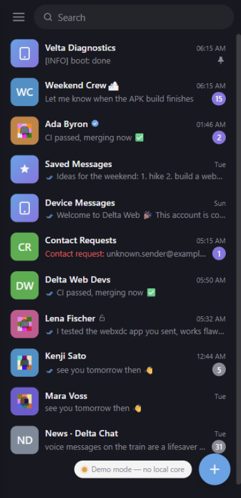
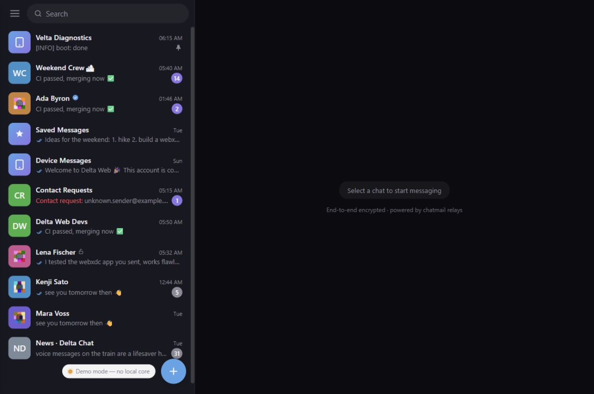
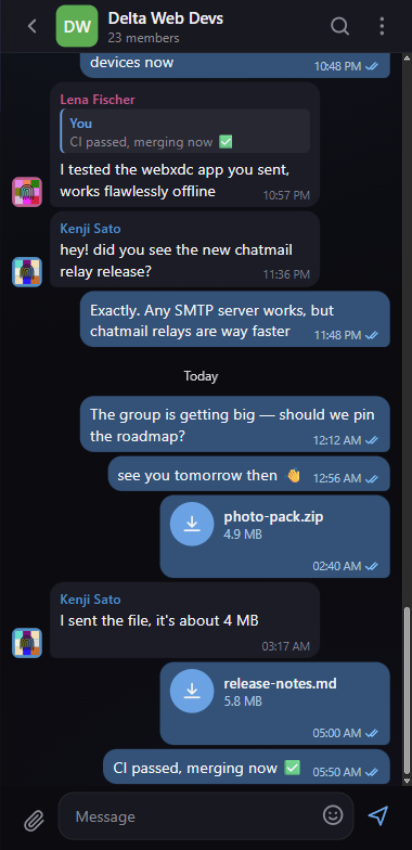
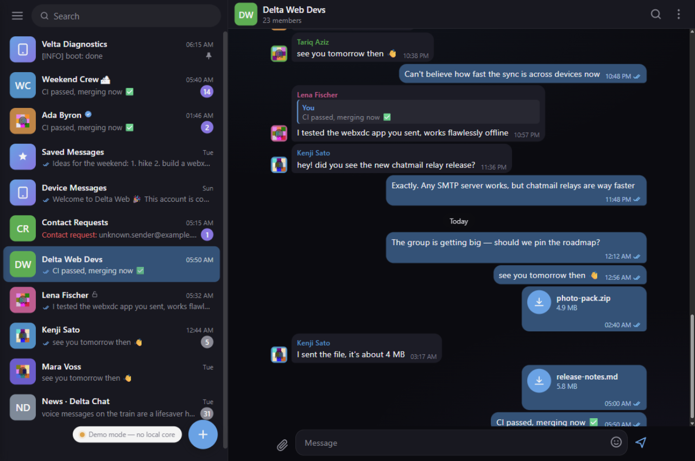

# Velta

A cross-platform **Delta Chat** client experiment built as a single PWA-ish web app wrapped by **Tauri 2**.

> ⚠️ **Status: Proof-of-Concept / 100% vibecoded**
>
> This project was built almost entirely through vibe-coding and iterative fixes. It is **not production-ready**: expect rough edges, incomplete features, and bugs. Treat it as a learning/demo project rather than a stable messenger.

## What it is 

Velta shares one web frontend (`app/`) between:

- **Windows desktop** — a Tauri 2 app that bundles `deltachat-rpc-server.exe` as a sidecar.
- **Android mobile** — the same Tauri 2 app, but the Delta Chat core runs in-process inside the APK.
- **Browser/PWA** — the same frontend can be served statically and connects to a local `delta-core-service` over loopback WebSocket/HTTP, or falls back to a mock core for demo purposes.

The UI is plain HTML/CSS/ES modules (no bundler). The backend is the upstream [Delta Chat core](https://github.com/chatmail/core) at version `2.59.0`.

## Screenshots

Captured from the responsive PWA running in demo mode (mock core), dark theme.

|                | Mobile | Desktop |
|:--------------:|:------:|:-------:|
| **Chat list**  |  |  |
| **Chat opened** |  |  |

## Identity avatars & contact profiles

Every **user** avatar renders a deterministic **color matrix** derived from the
contact's OpenPGP fingerprint: an equal-height 4-row grid (3 squares, 2 rects,
2 rects, 3 squares — one cell per fingerprint group), with a fingerprint glyph
centered on a soft-black badge for photo-less contacts, and the contact's photo
as a padded rounded square (with a thin dark ring) for contacts that set one.
Neighboring cells never share similar hues, all colors are soft (no pure
black/white), and everything is drawn as pure SVG in `app/js/avatar.js`.

Tapping any avatar in a chat opens the **contact profile** modal: the large
photo avatar beside the captioned identity tile (color names included), the
contact's address and profile key (OpenPGP fingerprint), last-seen info, a
native-share button for the personal `i.delta.chat` invite link, plus
**Send message**, **Edit name** and **Block** actions. Group chats also show a
**Chats in common** section listing the groups you share with that contact.

Group avatars intentionally keep a solid color with a full-bleed photo or
initials — the identity matrix is a per-contact feature.

## Project layout

```
.
├── app/                        # Velta web frontend (vanilla JS, no build)
├── delta-web-app/              # Tauri 2 wrapper for Windows + Android
│   └── src-tauri/
│       ├── Cargo.toml          # Rust crate + deltachat-jsonrpc dependency
│       ├── tauri.conf.json     # shared Tauri config
│       ├── tauri.android.conf.json
│       ├── tauri.ios.conf.json
│       ├── gen/android/        # generated Android project
│       └── src/
│           ├── lib.rs          # sidecar + Android in-process core glue
│           └── main.rs         # Tauri entry point
├── delta-core-service/         # Android background-service (JNI + WS bridge) APK
├── deltachat-backend/          # Prebuilt deltachat-rpc-server binaries
│   ├── windows-x86_64/
│   └── android-arm64/
├── tools/                      # icon generation, WSL APK build/sign helpers,
│                               # serve-dev.py (no-cache static server for app/)
├── signing/                    # local signing keystore (untracked)
└── core/                       # Vendored Delta Chat core Rust workspace
```

## Libraries & dependencies

The runtime has exactly **two vendored JavaScript libraries** — everything else
in `app/js/` (markdown renderer, avatar matrix, invite parsing, diagnostics)
is hand-rolled for Velta.

| Library | What it does here | Upstream |
|---|---|---|
| [Elena](https://github.com/arielsalminen/elena) (`@elenajs/core` v1.0.1) | Tiny progressive web-components library — powers `<dc-avatar>`, `<dc-chat-item>`, `<dc-chat-head>`, `<dc-video>` | [arielsalminen/elena](https://github.com/arielsalminen/elena) |
| [virtual-scroller](https://github.com/catamphetamine/virtual-scroller) (`virtual-scroller-dom`) | Windowed rendering of the message history with variable-height rows, seamless prepends and scroll restoration | [catamphetamine/virtual-scroller](https://github.com/catamphetamine/virtual-scroller) |
| [Tauri 2](https://github.com/tauri-apps/tauri) | Desktop/Android shell, deep links, sidecar process | [tauri-apps/tauri](https://github.com/tauri-apps/tauri) |
| [Delta Chat core 2.59.0](https://github.com/chatmail/core) | The messaging engine (Rust): contacts, chats, e2e crypto, IMAP/SMTP | [chatmail/core](https://github.com/chatmail/core) |

Both JS libraries are vendored under `app/vendor/` (no bundler, no `node_modules`
at runtime). UI icons are individual SVGs from [SVG Repo](https://www.svgrepo.com/).

## Requirements

- Rust **1.89+**
- Node.js **22+** (only for the Tauri tooling)
- `cargo-tauri` v2

```bash
cargo install tauri-cli --version "^2.0" --locked
```

### Windows build

- Windows 10/11
- For building the sidecar from source: Perl + NASM (needed by vendored OpenSSL in `rusqlite`).

### Android build

- Android SDK + NDK r27 (e.g. `ndk;27.2.12479018`)
- JDK 17
- Targets installed via rustup:
  `aarch64-linux-android`, `armv7-linux-androideabi`, `i686-linux-androideabi`, `x86_64-linux-android`

#### WSL-only NDK note

If you install the NDK inside WSL (e.g. `~/android/sdk/ndk/r27c`) make sure the extracted NDK preserves symlinks. Python's `zipfile` module strips symlinks by default, which breaks the LLVM toolchain. Extract the NDK zip with a symlink-aware tool such as `unzip` or a small Python helper that checks `zipfile.ZipInfo.create_system == 3` before writing entries. After extraction verify that toolchain binaries like `toolchains/llvm/prebuilt/linux-x86_64/bin/aarch64-linux-android24-clang` resolve correctly.

## Build locally

### Windows installer

Build the sidecar first:

```bash
cd core
cargo build -p deltachat-rpc-server --release
```

Stage it for Tauri:

```powershell
New-Item -ItemType Directory -Force -Path "delta-web-app/src-tauri/binaries"
Copy-Item "core/target/release/deltachat-rpc-server.exe" `
  "delta-web-app/src-tauri/binaries/deltachat-rpc-server-x86_64-pc-windows-msvc.exe"
```

Then build the installer:

```bash
cd delta-web-app
cargo tauri build
```

Output:

- `delta-web-app/src-tauri/target/release/bundle/msi/*.msi`
- `delta-web-app/src-tauri/target/release/bundle/nsis/*.exe`

### Android APK (arm64-v8a phones)

```bash
cd delta-web-app
cargo tauri android build --apk --target aarch64
```

The unsigned APK will be in:

```
delta-web-app/src-tauri/gen/android/app/build/outputs/apk/arm64-v8a/release/
```

To sign it locally:

```bash
keytool -genkey -v -keystore velta-debug.keystore -alias velta \
  -keyalg RSA -keysize 2048 -validity 10000 \
  -storepass velta123 -keypass velta123 -dname "CN=Velta"

zipalign -p -f 4 app-arm64-v8a-release-unsigned.apk app-arm64-v8a-release-zipaligned.apk

apksigner sign --ks velta-debug.keystore \
  --ks-pass pass:velta123 --key-pass pass:velta123 \
  --out app-arm64-v8a-release-signed.apk \
  app-arm64-v8a-release-zipaligned.apk
```

Add `--split-per-abi` if you need separate APKs for other architectures.

## GitHub Actions

Pre-configured workflows live in `.github/workflows/`:

| Workflow | What it builds |
|---|---|
| `build-android.yml` | arm64-v8a Android APK on `ubuntu-latest` |
| `build-windows.yml` | Windows installer on `windows-latest`, compiling the sidecar natively (needs Perl + NASM) |
| `build-windows-cross.yml` | Windows installer where the sidecar is cross-compiled on Ubuntu to avoid installing Perl/NASM on Windows |

The Android and cross-compiled Windows workflows are the easiest starting points if you just want an artifact.

## Deep links

Velta can open invite and account-setup links directly instead of making the user copy-paste them.

### Supported link formats

| Platform | Link type | What happens |
|---|---|---|
| Android | `https://i.delta.chat/#FINGERPRINT&v=3&…` (or a registered mirror domain, e.g. `https://i.gluek.info/#…`) | Intercepted by the Android intent filters and processed in-app. |
| Android / PWA | `dcaccount:https://nine.testrun.org/new` | Configures a new chatmail account. |
| Desktop (Windows/Linux) | `velta://invite?url=<encoded i.delta.chat URL>` | Opens Velta and joins the 1:1 or group chat. |
| Desktop (Windows/Linux) | `velta://account?url=<encoded dcaccount URL>` | Opens Velta and creates a chatmail account. |
| Contact verification | `OPENPGP4FPR:…` | Can be processed as a SecureJoin/verification QR. |

### Invite link mirrors and invite cards

An invite link's payload lives in the URL fragment (`#FINGERPRINT&v=3&…`) and is never
sent to a server — the host is decorative. Velta therefore accepts any **registered
mirror domain** and normalizes the link onto the canonical `i.delta.chat` form before
handing it to the core (which only parses that scheme).

- **Registry** — built-in hosts (`i.delta.chat`, `i.gluek.info`) plus user-added ones,
  managed in the drawer under *Settings → Invite link domains* (stored in
  `localStorage["velta-invite-hosts"]`, logic in `app/js/invites.js`).
- **OS-level interception is compile-time** — Android intent filters live in
  `AndroidManifest.xml` and can only be changed by adding the domain there and
  rebuilding. The runtime registry covers everything inside Velta: OS deep links
  (already routed to the app), links tapped in chat messages, and pasted links.
- **Invite cards** — an invite link inside a message renders as a card instead of a raw
  URL: the main part reads *"Pavel invited you to a Chat RU group"* or *"Chat with
  Pavel"* (parsed from the link's own `n=`/`g=`/`a=` params) and asks for confirmation
  before joining; a copy icon on the right copies the original link.

### Why Windows needs a custom `velta://` scheme

Windows does **not** allow a normal desktop app to intercept a specific `https://` host like `i.delta.chat` — that power belongs to the default browser. So on Windows Velta registers a custom URI scheme (`velta://`) through `tauri-plugin-deep-link`. The first time the app runs it writes the registry entry for the scheme, after which the OS will launch Velta for any `velta://…` link.

### Wrapping an invite link for Windows

Take an official Android invite link:

```
https://i.delta.chat/#DD1FDB8A5621D4A89DE00542234A2D9967B07594&v=3&i=fbrK144cdHV&s=GI2Y07eCqylGp6j5J_QCZ1vz&a=0so6eoc9s%40d13.buro.dev&n=Pavel
```

Encode the part after `url=` and build a `velta://` link:

```
velta://invite?url=https%3A%2F%2Fi.delta.chat%2F%23DD1FDB8A5621D4A89DE00542234A2D9967B07594%26v%3D3%26i%3DfbrK144cdHV%26s%3DGI2Y07eCqylGp6j5J_QCZ1vz%26a%3D0so6eoc9s%2540d13.buro.dev%26n%3DPavel
```

Quick JavaScript helper:

```js
function toVeltaInvite(httpsUrl) {
  return "velta://invite?url=" + encodeURIComponent(httpsUrl);
}
```

Clicking that link will focus an existing Velta window or start a new one, show a progress modal, and run `secureJoin()` against the decoded invite.

### How it is implemented

- **Android** — `delta-web-app/src-tauri/gen/android/app/src/main/AndroidManifest.xml` declares `VIEW` intent filters for `https://i.delta.chat` and mirror domains (`i.gluek.info`; one filter each — add more there and rebuild to extend OS-level interception). The Rust layer emits the URL to the frontend as a `deeplink` event.
- **Windows/Linux** — `tauri-plugin-deep-link` registers the `velta://` scheme. `tauri-plugin-single-instance` (with the `deep-link` feature) forwards second-instance launches to the running window. The plugin emits a `deep-link://new-url` event that the frontend listens to.
- **Common frontend handling** — `app/js/app.js` has `extractJoinLink()`, `extractInviteLink()`, and `extractVeltaLink()`. They normalise every supported format and route it to either the SecureJoin flow (`joinFromInvite`) or the account-setup flow (`addAccountFromInvite`). Link recognition, mirroring, and the invite-card rendering live in `app/js/invites.js`.

### Testing locally

- **Android** — tap an `https://i.delta.chat/#…` link from any app. The system should offer to open it with Velta.
- **Windows** — after installing and running Velta once, open a `velta://invite?url=…` link from a browser address bar or a local HTML file. The app should open and show the join progress modal.

### Limitations

- Windows cannot intercept the official `https://i.delta.chat/#…` links directly. To make those links open Velta automatically on Windows, a browser extension that rewrites them to `velta://` URLs would be required.
- macOS deep links are configured in the same `velta://` desktop path, but they are currently untested.

## Sending files, photos and videos

The composer has a paper-clip attachment button. From there you can send:

| Type | How it is sent | How it is shown |
|---|---|---|
| Photo | `viewtype: Image` with the original file path | Rendered inline as an `` |
| Video | `viewtype: Video` | Rendered inline as a `<video controls>` element |
| Audio / voice | `viewtype: Audio` or `Voice` | Rendered inline as an `<audio controls>` element |
| Any file | `viewtype: File` | Shown as a file card with name, size and a download/open action |

Implementation files:

- `app/js/chat-view.js` — attachment menu, native file picker (`plugin:dialog|open`), media rendering and the download button.
- `app/js/rpc-core.js` — `sendMessage()`, `getMessage()` and `downloadFullMessage()` wrappers around the core JSON-RPC methods.
- `app/css/main.css` — styles for `.msg-image`, `.msg-video`, `.msg-audio` and `.msg-file`.

### How media is loaded

Real media blobs live in the Delta Chat account directory and cannot be reached by a `file://` URL from the WebView. For images, video and audio the UI uses `__TAURI__.core.convertFileSrc(path)` (Tauri’s local-file access helper) to generate a WebView-safe URL, then sets it as the `src` of the inline element. Files are opened with `plugin:opener|open_path`.

On Android, `<video>`/`<audio>` sources ride a loopback HTTP server (`127.0.0.1:20810`, random per-launch token, account-directory-scoped) instead: the asset protocol there answers the first range read but fails mid-file ones, which kills demuxing of moov-at-end MP4s (most phone recordings). The network security config permits cleartext to loopback only. Posters for the click-to-play placeholder are extracted once per file (blob read → hidden `<video>` → canvas → WebP) into `velta-posters/` inside the account directory and served through the asset protocol.

### Video placeholder: poster frame and size badge

The click-to-play widget shows the extracted poster frame, the file size badge in the top-left corner and the duration in the bottom-right. Extraction is lazy (only when the row is mounted), serialized to one decode at a time, skipped for files above 128 MB, and cached on disk so later mounts are instant. Any failure falls back to the plain placeholder.

### Downloading large messages

Delta Chat splits very large messages into a small placeholder plus a downloadable body. When a message has `downloadState` other than `Done`, Velta shows a card with a download icon instead of the media player. Tapping it calls `download_full_message(msgId)` and then refreshes the message, which swaps the placeholder for the real image / video / audio player or the open-file card.

### Attachment size limit

`Config::DownloadLimit` defaults to `0` (no automatic size limit), so the core normally downloads the whole message automatically. For outgoing attachments the Delta Chat core recommends staying below roughly **18 MB** of raw file data (around 24 MB after base64 encoding), defined by `RECOMMENDED_FILE_SIZE` in `deltachat-core-rust`. Velta does not enforce this itself; it just passes the file to the core.

`Config::MediaQuality` (`0` = Balanced, `1` = Worse) controls image compression on send, so the UI does not need to resize images before sending.

### Platform notes

- **Windows / desktop** — file pickers return real filesystem paths and everything works end-to-end.
- **Android** — the Tauri dialog may return a `content://` URI that the Delta Chat core cannot read directly. Velta copies picked files into the app’s local data directory using `tauri-plugin-fs` before passing an absolute path to `send_msg`.

## Message formatting and replies

Message text renders a simple, escape-first markdown subset (`app/js/markdown.js`):

| Syntax | Result |
|---|---|
| `**bold**` | **bold** |
| `*italic*` / `_italic_` | *italic* |
| `__underline__` | underline |
| `[label](https://…)` | clickable link (bare URLs linkify too) |
| `- item` / `* item` / `+ item` | bulleted list |
| `1. item` / `1) item` | numbered list (a start value like `3.` is honored) |

Everything is HTML-escaped before any tag is produced and only `http(s)` targets become links, so message content can never inject markup. Emphasis markers are word-boundary guarded (`2*3*4` and `snake_case_name` stay literal). Invite links (`i.delta.chat` and registered mirror domains) render as invite cards instead of links — see [Deep links](#deep-links). Invites carrying a `b=` parameter are broadcast channels and render as *"Subscribe to ChannelName"* with a Subscribe confirmation instead of the group wording.

Hovering a message on desktop shows a small **Reply** pill at the bubble's top-right corner — one click sets the reply (same pipeline as the context menu's Reply) and focuses the composer. The pill is hidden on touch devices and during message selection.

Note: other Delta Chat clients render only the core's markdown subset (bold, italic, strikethrough, code). Underline and lists are Velta-side rendering niceties — other clients show those markers literally.

## Theming and accessibility

The palette avoids pure black and pure white everywhere — whites live in the `#f2f2f5`/`#f4f4f4` family and blacks in the `#0b0b10`–`#1c1c26` family (the avatar identity tiles already followed this rule). Text and surface pairs are held to **WCAG AA (≥ 4.5:1 contrast)**, measured with the WCAG relative-luminance formula after compositing any translucent layers:

| Pair (dark theme) | Contrast |
|---|---|
| Body text `#f2f2f5` on app background `#0f0f14` | 17.1 : 1 |
| Bubble text on incoming bubble `#1c1c26` | 15.1 : 1 |
| Bubble text on outgoing bubble `#2b5278` | 7.3 : 1 |

Reply quotes use a dedicated palette per bubble and theme (the generic accent/dim colors measured as low as 2.08 : 1 on the blue outgoing bubble): the quote name and text now measure **5.2 – 7.0 : 1** in every theme/side combination. When introducing a new color, composite it over its real background (rgba layers included) and check the ratio before merging.

## Deleting messages

Deleting a message (long-press / right-click → Delete) opens the same dialog as
official Delta Chat desktop:

| Action | What happens |
|---|---|
| **Delete for me** | Removes the message on this device and deletes it from the relay's storage. Other members keep their copy. |
| **Delete for everyone** | Also asks every chat member's device to delete the message. The core sends a hidden, encrypted deletion request (`Chat-Delete` header) that other Delta Chat clients honor. |

"Delete for everyone" is only offered when the core can support it: the
selected messages must be **your own** and **end-to-end encrypted**, and the
chat must not be Saved Messages. Deleting for everyone is a request — members
running clients without deletion support will keep their copy.

Related indicator: encrypted chats show no lock icon (e2e is the default).
Unencrypted 1:1 chats — classic-email contacts that chatmail relays cannot
encrypt to — are marked with a small open-shackle lock in the chat list and
chat header instead.

## Known limitations

- This is a **PoC**. Group creation, contact discovery, QR invites, and real-time message rendering all work in basic flows but have not been stress-tested.
- Logging to `velta.log` is disabled in the stable branch; use the status pill and browser/Tauri dev tools to diagnose issues.
- On Windows, the app needs the sidecar binary to talk to the real core. If the sidecar fails to start the frontend falls back to the mock core.
- On Android, the app currently uses the in-process core inside the Tauri APK. A separate background-service variant (`delta-core-service/`) builds a working service APK but is secondary to the Tauri app.

## License

See [`LICENSE`](LICENSE).
